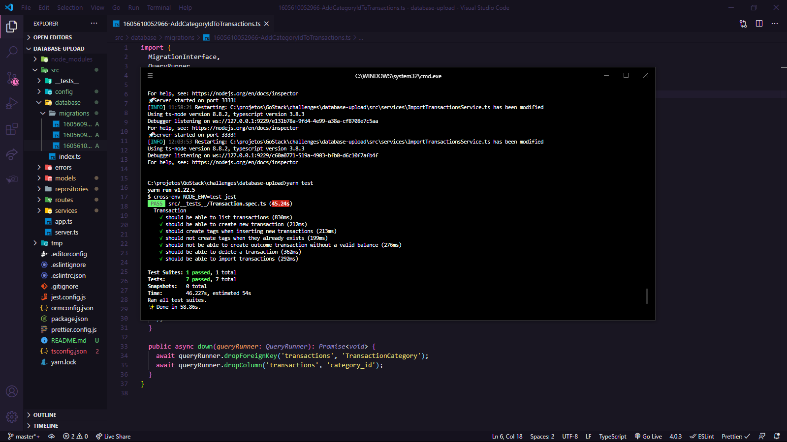

_English_

# Database upload

🚀 About the challenge

In this challenge, I continued developing the transaction management application, training what I have learned so far in Node.js with TypeScript, but this time including using a database with TypeORM and sending files with Multer!

`Screenshot of tests`

---

_Português_

# Upload de banco de dados

🚀 Sobre o desafio

Nesse desafio, continuiei desenvolvendo a aplicação de gestão de transações, treinando o que eu aprendi até agora no Node.js junto ao TypeScript, mas dessa vez incluindo o uso de banco de dados com o TypeORM e envio de arquivos com o Multer!

`Captura de tela dos testes`

